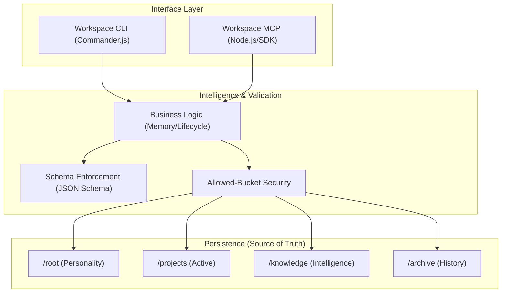
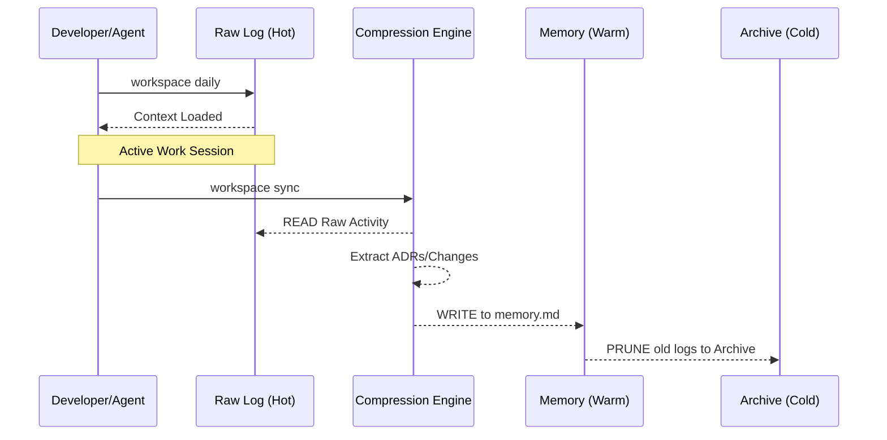

# 🏗️ ContextOS Feature Architecture

ContextOS is a modular infrastructure designed to scale from individual local projects to enterprise-grade AI-agent ecosystems.

---

## 🏛️ System Component Overview

The architecture follows a strictly layered model where interfaces are decoupled from business logic and data storage.

---

## 🔒 Security Model: "Allowed-Bucket" Isolation

ContextOS implements a strict **Whitelist-only** security model for all operations. This is critical for preventing autonomous agents from traversing parent directories or reading sensitive user files.

1.  **Workspace Root Discovery**: Dynamically locates the root (via `root/soul.md`) to establish the "Boundary."
2.  **Path Canonicalization**: Uses `fs.realpathSync` and `path.resolve` to resolve symlink attacks and directory traversal (`..`).
3.  **Bucket Enforcement**: All paths must resolve to one of the pre-defined "Buckets" (`projects/`, `orgs/`, `knowledge/`, `schemas/`, `log/`, `archive/`, `root/`).
4.  **Read-Only Protections**: Specific buckets (`knowledge/`, `schemas/`, `root/`) are marked as read-only for agents to prevent "Context Corruption."

---

## 🧠 Memory & Intelligence Lifecycle

ContextOS differentiates between raw activity and structured memory.

### ⚡ Memory Tiers
*   **Hot (Raw Logs)**: Highly detailed, transient, located in `daily/*.md`.
*   **Warm (Active Memory)**: Structured, high-context, located in `memory.md`.
*   **Cold (Historical Archive)**: Minimal detail, immutable, located in `archive/`.

---

## 📐 Structural Integrity (Schema Enforcement)

Every piece of context in ContextOS is validated against strict JSON Schemas.

| Resource | Schema | Enforced Fields |
| :--- | :--- | :--- |
| **Soul** | `soul.schema.json` | Identity, Mission, Core Principles |
| **Context** | `context.md` | Technical Overview, Dependencies, Goals |
| **Memory** | `memory.md` | Recent Changes, Knowledge Graph |
| **Decision** | `decisions.md` | ADR Format, Context, Rationale, Status |

---

## 👨‍💻 Git Flow

ContextOS treats the file system as the database and **Git as the transaction log**.

- **Atomic Commits**: Every write tool in the MCP server automatically triggers a Git commit using safe `spawn` operations.
- **Traceability**: All agent-driven changes are identifiable in the commit history, providing a permanent audit trail of AI activity.
